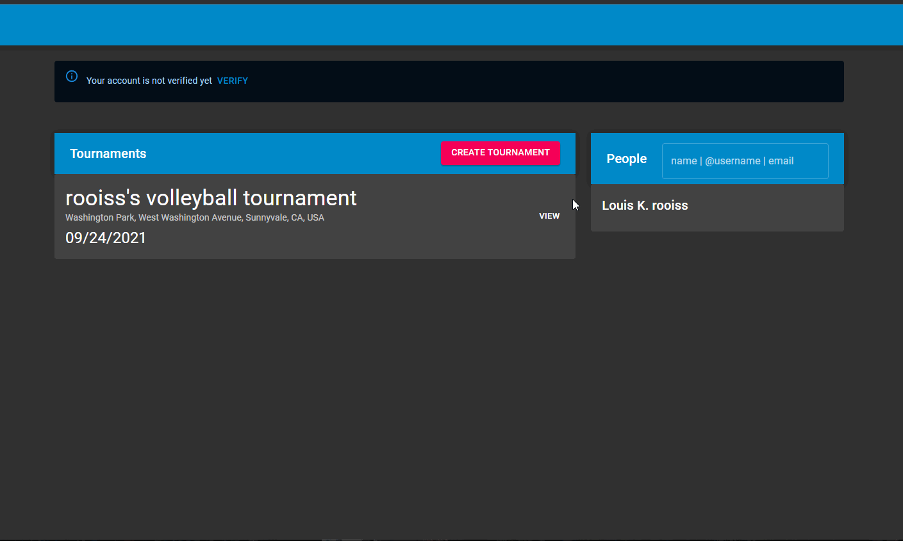

# Volleyball Tournament Management App

## Overview

[Live Site](https://volleyballtournaments.xyz)

A Volleyball tournament management app that allows tournament organizers to create tournaments and for players to create teams and invite teammates to join their teams.

[landing](Landing.png)

## Technologies

- Frontend: React, hooks/contextAPI, TypeScript, JSS, Material UI,
- Backend: docker, docker-compose, docker-sync, Nginx, PostgreSQL, redis, Node.js, express, TypeORM, circleci
- Google Maps API, Gmail Oauth
- [nodemailer](https://nodemailer.com/about/)

The Volleyball Tournament Management App was built with a Express framework, utilizing PostgresSQL for organized data storage, redis for fast session storage, and the React hooks and contextAPI libraries for dynamic frontend, single-page app navigation and interactivity.

## Features

### Create a tournament

As a tournament organizer/director you're able to create a tournament using the google maps API and the Google Places autocomplete feature

!(create a tournament)(createTournament.gif)

### Find tournaments

As a player you're able to find tournaments by following your local organization

### Create a team

As a player you'll also be able create a team when you find the tournament you want to sign up for

### Join a team

As a player you can join a team that has sent you an invite

## Running this project locally

1. Clone this project locally
2. Download docker for desktop
3. Start docker for desktop
4. Run the start-docker-dev-bash script
5. In the client folder run the npm start command

## To Do

- [ ] debounce all search inputs
- [ ] validations for creating tournament
- [ ] teaminvite router validation for accepting single invite
- [ ] team validation for player creating multiple teams
- [ ] reject all other invites when accepting an invite
- [ ] once register button is clicked send emails out to all players of the tournament to confirm
- [ ] protectedRoute
- [ ] email validator for adding non registered users
- [ ] email obfuscation deter webscrape
- [ ] format and divisions for tournament entity and create tournament page
  - [ ] title of tournament is `${username}'s ${tournament.format} on ${tournament.date}`
- [ ] add division to tournament entity
- [x] delete a tourney
- [x] re-render component for team invites list when any invite status changes
- [x] username as other column for tournament
- [x] change how follows works to either context or parent component that handles all following state (search component)

## Nice to haves

- [ ] PayPal / stripe integration for payment
- [ ] waiver form when registering / DocuSign / HelloSign API
